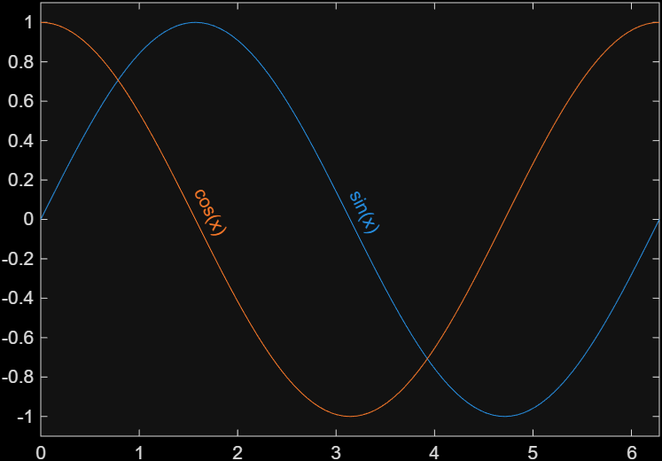
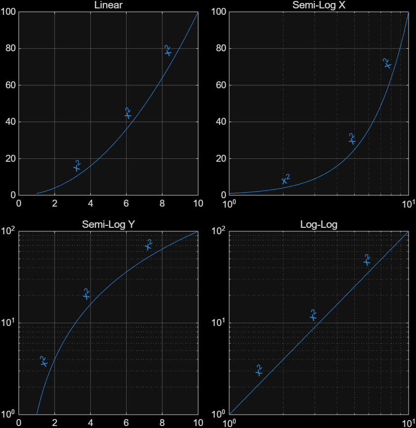
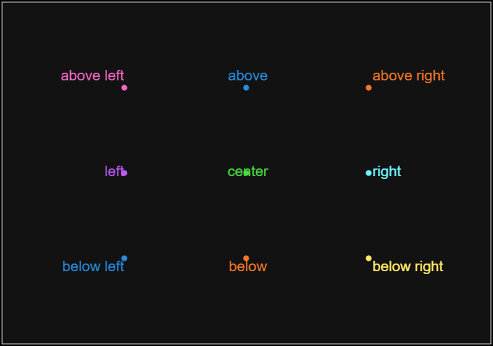

# matlabLabelLines
Place MATLAB plot labels directly on lines, similar to pgfplots node option

## Basic usage
Pass the line handle to `label_line`.  The axis limits and size
must be set prior to calling `label_line`, along with any axis scale
changes.
The `Sloped=true` option rotates the label to align with the local line
direction.  The first positional argument specifies the relative position
of the label along the line.
``` matlab
x = linspace(0, 2*pi, 101);

figure(Units="inches", Position=[1,1,6,4]);
ha = axes;hold on;grid off;box on;
ha.XLim = [0, 2*pi];
ha.YLim = [-1, 1]*1.1;
h = plot(x, sin(x), "-", DisplayName="sin(x)");
label_line(h, 0.5, Sloped=true);

h = plot(x, cos(x), "-", DisplayName="cos(x)");
label_line(h, 0.25, Sloped=true);
```


## Axis Options
Linear, semi-log, and log-log axes are supported.  Any changes to 
`XScale` or `YScale` should be done before drawing the label.

``` matlab
x = linspace(1, 10, 100);
figure(Name="ex0.9 log", Units="inches", Position=[1,1,6, 6])
tiledlayout(2, 2, TileSpacing="compact", Padding="compact");

ha = nexttile;hold on;box on;grid on;
title("Linear", FontWeight="normal")
h = plot(x, x.^2, DisplayName="x^2");
label_line(h, [0.2, 0.5, 0.8], Sloped=true);

ha = nexttile;hold on;box on;grid on;
title("Semi-Log X", FontWeight="normal")
h = plot(x, x.^2, DisplayName="x^2");
ha.XScale = "log";
label_line(h, [0.2, 0.5, 0.8], Sloped=true);

ha = nexttile;hold on;box on;grid on;
title("Semi-Log Y", FontWeight="normal")
h = plot(x, x.^2, DisplayName="x^2");
ha.YScale = "log";
label_line(h, [0.2, 0.5, 0.8], Sloped=true);

ha = nexttile;hold on;box on;grid on;
title("Log-Log", FontWeight="normal")
h = plot(x, x.^2, DisplayName="x^2");
ha.XScale = "log";
ha.YScale = "log";
label_line(h, [0.2, 0.5, 0.8], Sloped=true);
```


## Location Options
The `Location=XXX` option can be passed to `label_line`.  The default
option places the label above the line.
``` matlab
figure(Units="inches", Position=[1,1,6,4])
ha = axes("defaultLineMarkerSize",12);hold on;box on;grid off
ha.XLim = [-1, 3];
ha.YLim = [-1, 2];
ha.XTick = [];
ha.YTick = [];

h = plot(0, 0, ".", DisplayName="below left");
label_line(h, location=h.DisplayName);

h = plot(1, 0, ".", DisplayName="below");
label_line(h, location=h.DisplayName);

h = plot(2, 0, ".", DisplayName="below right");
label_line(h, location=h.DisplayName);

h = plot(0, 1, ".", DisplayName="left");
label_line(h, location=h.DisplayName);

h = plot(1, 1, ".", DisplayName="center");
label_line(h, location=h.DisplayName);

h = plot(2, 1, ".", DisplayName="right");
label_line(h, location=h.DisplayName);

h = plot(0, 2, ".", DisplayName="above left");
label_line(h, location=h.DisplayName);

h = plot(1, 2, ".", DisplayName="above");
label_line(h, location=h.DisplayName);

h = plot(2, 2, ".", DisplayName="above right");
label_line(h, location=h.DisplayName);
```


## Known Limitations
- Can generate invalid positions if the line extends beyond the plot box.
  Most signfiicant when line extends well beyond the box or approaches infinity.
- Plotting large numbers of labels can be slow, as a call to `drawnow` is
  forced to draw each label.
- Only `Line` and `Scatter` objects are supported.  Note that `xline` and
  `yline`, which produce `ConstantLine` objects, have their own label 
  options.

## References
Initial inspiration came from practice of using a node
in the trailing plot commands within [pgfplot](https://tikz.dev/pgfplots/reference-annotations#sec-4.17.3).

The [NoLegend](https://www.mathworks.com/matlabcentral/fileexchange/51163-nolegend-labeling-lines-directly-instead-of-using-legends)
package performs a similar task.  It does handle log scales, but it
has limited location options and does not rotate labels.

The [label](https://www.mathworks.com/matlabcentral/fileexchange/47421-label)
package handles label location, but uses different positioning controls.


